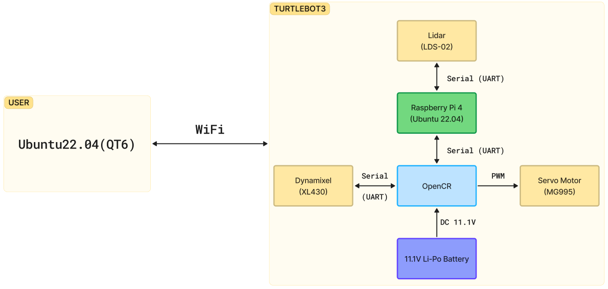

## 🚛 Logistics-Automation-Mini-Project

### 🛠 개발 배경
<table>
  <tr>
    <td align="center">
      
       <b>자율 이동 로봇 시장 규모</b>
    </td>
    <td align="center">
      
       <b>자율 이동 로봇 시장 분석 그래프</b>
    </td>
  </tr>
</table>

글로벌 시장 조사 기관 Global Market Insights에 따르면, AMR 시장은 2035년까지 연평균 19.5%의 고성장이 예상되며 물류 자동화의 중요성이 급증하고 있습니다. 

본 프로젝트는 기존 인력 중심 운송과 고정 경로 시스템의 한계를 극복하고자 A* 알고리즘 기반 자율 주행과 ROS2, Qt 시스템을 결합한 다중 AMR 통합 관제 시스템(AMR FLEET CORE)을 개발했습니다. 실시간 충돌 감지 및 동적 예외 처리(우선순위, 우회 등)를 통해 물류 지연을 방지하고, 지능형 현장 관리의 효율성을 극대화하는 것을 목표로 합니다.

### 📝 한 줄 요약
SLAM 자율 주행과 A* 알고리즘을 결합하여, 다중 로봇 간의 경로 간섭을 방지하고 작업 이력을 실시간으로 관리하는 지능형 통합 관제 시스템(AGV FLEET CORE)

---

## 📅 프로젝트 개요
- **프로젝트 명:** AMR FLEET CORE
- **수행 기간:** 2026.04.20 ~ 2026.04.27
- **주요 기능**
  - **1:** TurtleBot 2대 기반 다중 물류 로봇 제어
  - **2:** A* 알고리즘 기반 경로 탐색 및 장애물 회피
  - **3:** 우선순위, 임계구역, 재탐색, 대피소 기반 충돌 예외 처리
  - **4:** Qt 관제 UI와 MariaDB를 통한 실시간 모니터링 및 작업 이력 관리

---

## 🛠 기술 스택
| 분류 | 기술 Stack |
| :--- | :--- |
| **Languages** | C++, Python, Arduino(Sketch) |
| **Communication** | ROS2, Wi-Fi, Serial(UART) |
| **Frameworks** | Qt 6 |
| **Database** | MariaDB |
| **Hardware/OS** | Raspberry Pi4, OpenCR, Arduino Uno, TurtleBot3, LiDAR(LDS-01, LDS-02), Linear Actuator, Servo Motor(MG995), 컨베이어벨트, 적외선 근접 센서(TCRT5000), Ubuntu 22.04 |

---

## 🧩 시스템 아키텍처

### H/W Architecture

  

---

## 📂 디렉토리 구조

.  
├── 📂 **[backend/](./backend)**  
│&nbsp;&nbsp;&nbsp;└── 📄 amr_turtle_db_bakcup.sql  
├── 📂 **[images/](./images)**  
│&nbsp;&nbsp;&nbsp;└── 🖼  
├── 📂 **[motion_control/](./motion_control)**  
│&nbsp;&nbsp;&nbsp;├── 📂 **[actuator/](./motion_control/actuator)**  
│&nbsp;&nbsp;&nbsp;│&nbsp;&nbsp;&nbsp;└── 📄 actuator.ino  
│&nbsp;&nbsp;&nbsp;└── 📂 **[conveyor_belt/](./motion_control/conveyor_belt)**  
│&nbsp;&nbsp;&nbsp;&nbsp;&nbsp;&nbsp;&nbsp;└── 📄 conveyor_belt.ino  
├── 📂 **[qt_app/AFC_qt/](./qt_app/AFC_qt)**  
│&nbsp;&nbsp;&nbsp;├── 📁 .qtcreator/  
│&nbsp;&nbsp;&nbsp;├── 📂 **[src/](./qt_app/AFC_qt/src)**  
│&nbsp;&nbsp;&nbsp;├── 📄 CMakeLists.txt  
│&nbsp;&nbsp;&nbsp;├── 📄 LICENSE  
│&nbsp;&nbsp;&nbsp;└── 📄 package.xml  
├── 📂 **[robot/](./robot)**  
│&nbsp;&nbsp;&nbsp;└── 📄 agv_move_pub.py  
└── 📄 [README.md](./README.md)

---

## 🔍 상세 기능 설명
**1. 실시간 통합 관제 대시보드**
<table align="center">
  <tr>
    <td align="center"><b>로봇 모니터링 및 원격 제어</b></td>
    <td align="center"><b>작업 이력 및 재고 관리</b></td>
    <td align="center"><b>데이터베이스(DB) 구조</b></td>
  </tr>
  <tr>
    <td>
      
    </td>
    <td>
      
    </td>
    <td>
      
    </td>
  </tr>
  <tr>
    <td align="center">그리드 맵 기반 실시간 제어</td>
    <td align="center">작업 이력 관리 및 실시간 재고 현황</td>
    <td align="center">MariaDB 기반 테이블 구조</td>
  </tr>
</table>

* **멀티 로봇 모니터링:** 2대의 로봇 상태(위치, 배터리, 현재 작업)를 그리드 맵 기반 UI에서 실시간으로 확인합니다.
* **원격 제어:** 개별 로봇에게 목적지 하달 및 수동 조작 기능을 제공합니다.
* **데이터베이스 연동:** MariaDB를 통해 작업 이력 및 실시간 재고 현황을 관리하고 로그를 저장합니다.

**2. 지능형 경로 탐색 및 주행**
* **A\* 알고리즘 기반 네비게이션:** F = G + H 수식을 활용하여 목적지까지의 최적 경로를 계산합니다. (G : 출발 좌표부터 현재까지의 거리 비용, H : 현재 좌표에서 목적지까지의 예상 거리 비용, F : 총합 비용 점수)
* **커스텀 네비게이션 구현:** 표준 네비게이션 스택 대신 X, Y 좌표 기반의 독자적인 이동 로직을 구현하여 제어 정밀도를 높였습니다.

**3. 다중 로봇 협동 예외 처리**
* **우선순위 양보:** 동일 좌표 진입 시 높은 우선순위의 로봇이 먼저 통과하고 낮은 순위 로봇은 대기합니다.

<table align="center">
  <tr>
    <td></td>
    <td></td>
    <td></td>
  </tr>
</table>

* **임계 구역 설정:** 단일 진입로에 임계 구역을 지정하여 동시 진입으로 인한 데드락 상태를 방지합니다.

<table align="center">
  <tr>
    <td></td>
    <td></td>
    <td></td>
  </tr>
</table>

* **경로 재탐색:** 장애물이나 타 로봇으로 인해 경로가 차단될 경우 실시간으로 우회 경로를 계산합니다.

<table align="center">
  <tr>
    <td></td>
    <td></td>
  </tr>
</table>

* **대피소 활용:** 충돌 위험 시 가장 가까운 대피소 좌표로 이동하여 통로를 확보합니다.

<table align="center">
  <tr>
    <td></td>
    <td></td>
  </tr>
</table>

**4. 액추에이터 및 컨베이어벨트 자동화 시스템**

  
   <i>[실제 구현된 하드웨어 시스템]</i>

<table align="center">
  <tr>
    <td align="center"><b>액추에이터 회로도</b></td>
    <td align="center"><b>컨베이어 벨트 회로도</b></td>
  </tr>
  <tr>
    <td>
      
    </td>
    <td>
      
    </td>
  </tr>
  <tr>
    <td align="center">OpenCR + MDD10A 기반 제어</td>
    <td align="center">Arduino Uno + L9110S 기반 제어</td>
  </tr>
</table>

* **리니어 액추에이터 작동:** 적외선 센서가 물체를 감지하면, 액추에이터가 9초간 전진하여 물건을 밀어내고 다시 9초간 후진하여 제자리로 돌아옵니다 (1세트 동작).
* **컨베이어 벨트 작동:** 입구 적외선 센서에 물건이 감지되면 벨트가 회전합니다. 물건이 끝 지점(출구 적외선 센서)에 도착하면 물류가 쌓이지 않도록 즉시 벨트를 멈춥니다.

---

## 🖼 시연 화면
<table width="100%">
  <tr>
    <td align="center">
      
    </td>
  </tr>
  <tr>
    <td align="center">
      
    </td>
  </tr>
  <tr>
    <td align="center">
      
    </td>
  </tr>
</table>

---

## 🎬 시연 영상
<table align="center">
  <tr>
    <td align="center"><b>A* 다중 로봇 경로 최적화 시연</b></td>
    <td align="center"><b>Qt 기반 관제 시스템</b></td>
  </tr>
  <tr>
    <td>
      
    </td>
    <td>
      
    </td>
  </tr>
</table>

## ⚠️ 보완점 및 향후 과제
- **Pose 및 좌표 재보정**  
  LiDAR 센서를 활용해 양옆, 전후 거리를 측정하고 목표 좌표 도착 후 위치 및 각도 오차를 자동 보정하는 기능을 추가할 예정이다.

- **카메라 및 QR 코드 인식**  
  OpenCV 기반 QR 코드 인식을 통해 위치 검증 및 화물 정보를 확인하고, 인식 결과에 따라 원하는 좌표로 이동하는 로직으로 확장할 예정이다.

- **Grid Map 생성 자동화**  
  현재 하드코딩된 Grid Map 구조를 개선하여, TurtleBot을 수동 조작하면서 이동 가능한 좌표를 기록하고 파일로 저장하는 기능을 적용할 예정이다.

- **실시간 장애물 대응 및 동적 재탐색**  
  주행 중 예기치 않은 장애물이나 경로 차단 상황이 발생할 경우, 현재 위치 기준으로 경로를 다시 계산하는 기능을 강화할 예정이다.

- **다중 로봇 확장성 개선**  
  현재 2대 기준으로 검증한 충돌 회피 및 작업 스케줄링 구조를 3대 이상의 TurtleBot 환경에서도 안정적으로 동작하도록 확장할 예정이다.
---

## 💁‍♂️ 팀원

| 이름 | 역할 | 담당 파트 |
|----------|----------|----------|
| 김준기 | 팀장 | |
| 허준형 | 부팀장 | DB 설계, 컨베이어 벨트 구동 제어, QT & 터틀 봇 연동 작업 |
| 정구빈 | Frontend/Firmware | Qt 기반 통합 관제 대시보드 구현 및 액추에이터 구동 제어 |
| 박준서 | | 테스트 커밋 |
